# Serilog and Elastic Stack integration<!-- omit in toc --> 

## Purpose<!-- omit in toc --> 
To document how serilog and elastic stack instalation is done and how integration between the two is achieved

## Questions<!-- omit in toc --> 
- How to integrate and configure Serilog/Elastic Stack in an application
- How can the sent data be controlled?
- Can the same application send information to multiple indexes?
- How will the logs from the various applications be displayed?
- How detailed are the exceptions?
  - Compare against Exceptionless (confirm user is present and stack trace)
  
# Content<!-- omit in toc --> 
- [Installation Guide for Elastic Stack in Self Hosted Environment](#installation-guide-for-elastic-stack-in-self-hosted-environment)
  - [Starting remarks](#starting-remarks)
  - [System Requirements](#system-requirements)
- [Pre-requisites](#pre-requisites)
  - [Installing docker-compose](#installing-docker-compose)
    - [Apply permissions to the docker-compose binary](#apply-permissions-to-the-docker-compose-binary)
  - [Folder and file configuration](#folder-and-file-configuration)
  - [Installing ElasticStack](#installing-elasticstack)
- [Configuring the Elastic Stack](#configuring-the-elastic-stack)
  - [Configuring the ElasticStack - Kibana comunication](#configuring-the-elasticstack---kibana-comunication)
  - [Production Deployment](#production-deployment)
  - [Accessing the services](#accessing-the-services)
  - [Limiting access to users](#limiting-access-to-users)
    - [User/Role Creation](#userrole-creation)
    - [Limiting views](#limiting-views)
  - [Validation](#validation)
- [Ingesting Data](#ingesting-data)
  - [Configuration](#configuration)
- [Alerting with Elastic Stack](#alerting-with-elastic-stack)
  - [Configuration](#configuration-1)
  - [Connectors](#connectors)
  - [Configuring an alert](#configuring-an-alert)
- [Dashboards and Canvas](#dashboards-and-canvas)
  - [Dashboards](#dashboards)
  - [Canvas](#canvas)
  - [Exporting](#exporting)
- [Backups](#backups)
- [Results](#results)
- [References](#references)
- [Serilog - Elastic Stack integration](#serilog---elastic-stack-integration)
  - [About](#about)
  - [Requirements](#requirements)
  - [What data needs to be collected in the logs?](#what-data-needs-to-be-collected-in-the-logs)
- [Configuring Serilog](#configuring-serilog)
  - [Code](#code)
    - [Startup.cs](#startupcs)
    - [Program.cs](#programcs)
    - [AppSettings.Json](#appsettingsjson)
    - [Log Levels](#log-levels)
  - [Usage Example](#usage-example)
  - [Controlling Data](#controlling-data)
  - [Detailed Information](#detailed-information)
  - [Logs from multiple applications](#logs-from-multiple-applications)
  - [Pushing data to multiple indexes](#pushing-data-to-multiple-indexes)
- [Offline environment](#offline-environment)
  - [Write to local file when connection is offline](#write-to-local-file-when-connection-is-offline)
  - [Write to other server if the first fails to connect](#write-to-other-server-if-the-first-fails-to-connect)
  - [Full configuration](#full-configuration)
  - [Conclusion](#conclusion)
  - [References](#references-1)

# Installation Guide for Elastic Stack in Self Hosted Environment

## Starting remarks
* Every docker command was done through `putty` with the user `appuser`
* Every docker command was prefixed with the `sudo` command, from this point onward it'll be **implicit**

---

## System Requirements

- Disk Space - 1,5Gb minimum 
- RAM - 8Gb RAM minimum

Source: [Hardware Prerequisites](https://www.elastic.co/guide/en/cloud-enterprise/2.10/ece-hardware-prereq.html)

---
# Pre-requisites 

## Installing docker-compose
Get docker compose from hub

```
sudo curl -L "https://github.com/docker/compose/releases/download/1.29.2/docker-compose-$(uname -s)-$(uname -m)" -o /usr/local/bin/docker-compose
```

### Apply permissions to the docker-compose binary
```
sudo chmod +x /usr/local/bin/docker-compose
```
Source: [Install Docker Compose](https://docs.docker.com/compose/install/)


## Folder and file configuration

* Create a folder named `ElasticStack` in /srv
* Move your docker compose file and configs to that folder
* Give `777` permissions recurssively every file/folder inside the created folder
* Edit the docker-compose file and add `xpack.security.enabled=true` to the environment variables for `elasticsearch`

## Installing ElasticStack

- Run the command: `docker-compose up -d`

# Configuring the Elastic Stack

## Configuring the ElasticStack - Kibana comunication

- Enter the ElasticSearch container with the command `docker exec -it elasticsearch bash`
-  Navigate to the folder `./bin`
- Run `./elasticsearch-setup-passwords interactive`
  - When prompted, insert the passwords to be used by the default system users
- Leave the docker container by using `exit`

- Enter the Kibana container with the command `docker exec -it kibana bash`
- Navigate to the folter `./config`
- Edit the file `kibana.yml` with the command `vi kibana.yml`
- Add the following lines: 
  ```
  elasticsearch.username: "kibana_system"
  elasticsearch.password: "the_password_entered_for_the_user_kibana_system"
  ```
- Leave the docker container by using `exit`
- Restart the Kibana container by using `docker restart kibana`

## Production Deployment
- When deploying to a **production** environment edit the `docker-compose.yml` file and add to the `kibana > Environment` the following:
  ```
    SERVER_PUBLICBASEURL: URL_FOR_KIBANA:PORT
  ``` 

**Note**
- The publicly available URL that end-users access Kibana at. 
- Must include the protocol, hostname, port (if different than the defaults for http and https, 80 and 443 respectively), and the server.basePath (if configured). 
- This setting cannot end in a slash (/).

Source: [Configure Kibana](https://www.elastic.co/guide/en/kibana/master/settings.html)

## Accessing the services
- Elastic Search is in port 9200
- Kibana is configured in port 5601.
  - The default user is 'elastic' and password is the one configured during the configuration of the ElasticStack - Kibana comunication

---

## Limiting access to users

### User/Role Creation
- On the left side menu, under `Management`, access `Stack Management`
- Go to `Security` > `Roles` and create a **role** with **index privileges**
- Go to `Security` > Users and create a **user** with the previously created role

### Limiting views
 - Using a management account click the colored letter in the top left corner and select `Manage Spaces`
 - Create a space for the group
 - Go to `Security` > `Roles` and create a group that has assigned specific indexes and spaces
 - Set the appropriate privileges
 - Go to `Security` > `Users` and create a user that is assigned to the created role.


## Validation
- To validate the login use: 
```
curl -u <user_here> 'http://SERVER:PORT/_xpack/security/_authenticate?pretty' 
```
- When prompted input the password for the provided user

# Ingesting Data
In order to start using the Elastic Stack we need data from our applications. Data can be added by creating an index for our project that will be responsible for acting as a repository for all related data to that project.

## Configuration
- Go to `Management` > `Stack Management` > `Index Patterns`
- Click `Create Index Pattern`
- Fill out the `Name` formula to filter the results on the right table until you find the desired project
- Select the field that will serve as the `timestamp` (default: ``@timestamp``)
- Click `Create Index Pattern`

After this step all data collected that is related to the created index will be available in the `Discover` and `Dashboard` sections for analysis

**Note**: Conventions regarding `Indexes`, `Environment` and `Release` should be discussed with the Team prior to implementation in order to define a definitive convention.

# Alerting with Elastic Stack
- Build used: 7.9.2
- **Warning** Requires gold license (30-day free trial available)

## Configuration
- Edit the docker-compose file and add `xpack.security.authc.api_key.enabled=true` to the **elasticsearch environment variables** 
- Enter the Kibana container with the command `docker exec -it kibana bash`
- Navigate to `./config`
- Edit the `kibana.yml` file and add: `xpack.encryptedSavedObjects.encryptionKey: "[32 character key]"`
  - To generate this key is best to use a password generator
  - Take note of this key

---

## Connectors
1. Go to `Stack Management`
2. On the left bar search for and click `Alerts and Actions`
3. Define your e-mail properties as if you were configuring an e-mail client.
    - Source: [Define connector in Stack Management](https://www.elastic.co/guide/en/kibana/master/email-action-type.html#define-email-ui)

## Configuring an alert
1. Go to `Stack Management`
2. On the left bar search for and click `Alerts and Actions`
3. Create your alert by filling out the form with information relative to the action/alert you wish to create as well as the communication path

# Dashboards and Canvas
**Note** - These steps require the step [Injecting Data](#ingesting-data) to be completed first.

## Dashboards
- Go to the `Dashboard` section
- Click `Create visualization`
- On top left corner select the desired index
- Build your widget by dragging one or more available fields to the Horizontal/Vertical Axis in order to populate the graph/table with data.

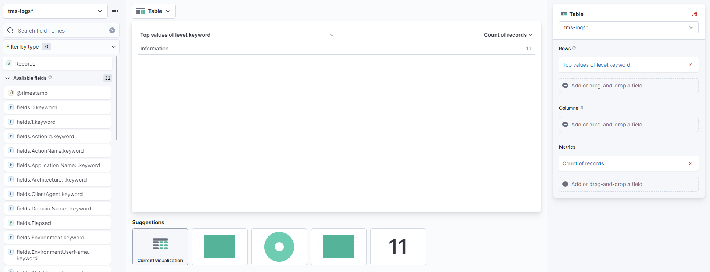

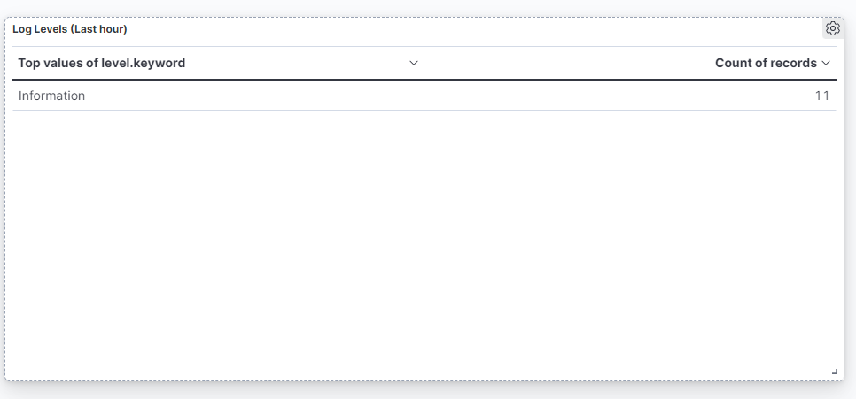

## Canvas
- Go to the `Canvas` section
- Click `Create workpad`
- On top left corner click `Add element` and add the desired element
- On the right pane select `Data`, then select `Elasticsearch SQL` or `Elasticsearch Documents`
- Select the desired `index` and `fields`
- Again on the right pane select `Display`
- Build your element by selecting one or more available fields in order to populate the graph/table with data.

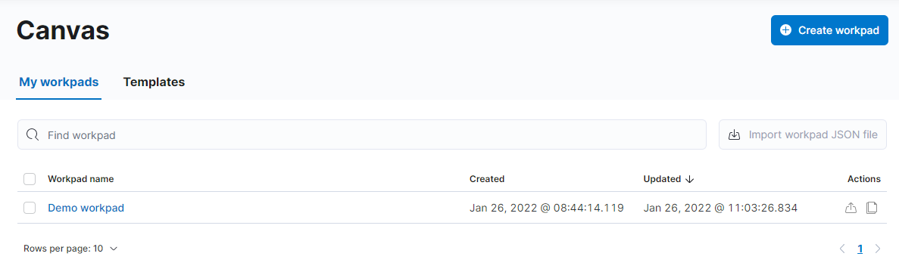
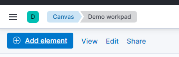
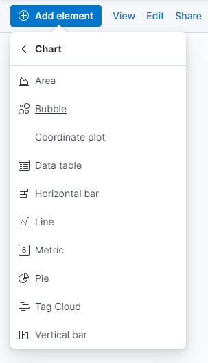
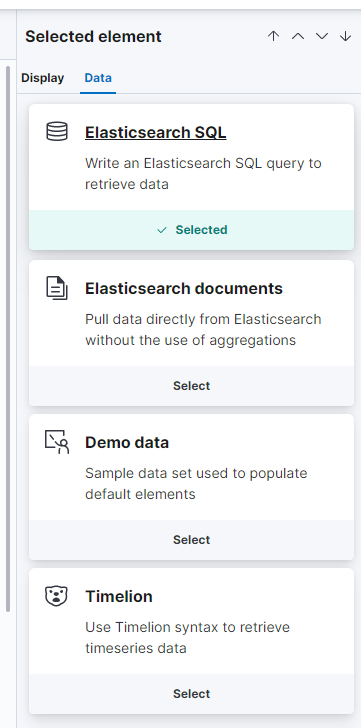
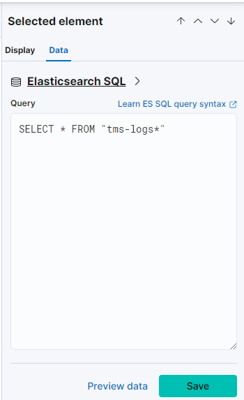
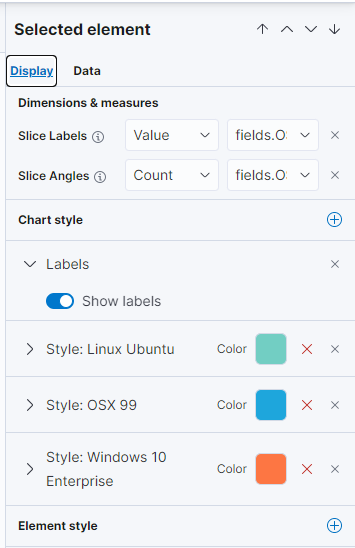

## Exporting 
**Note:** Exporting for dashboards or canvas to files is limited by licensing
- CSV and JSON > Free/Basic
- PDF and PNG > Gold or above 

Source: [Elastic Stack subscriptions](https://www.elastic.co/subscriptions)

# Backups
As mentioned in [Snapshot and Restore](https://www.elastic.co/guide/en/elasticsearch/reference/current/snapshot-restore.html), the Elastic Stack does not have a direct export mechanism. It does instead support a Snapshot mechanism where all files and containers are exported to a off-site location.

The supported locations are: 
  - AWS S3
  - Google Cloud Storage (GCS)
  - Hadoop Distributed File System (HDFS)
  - Microsoft Azure

In order to make a backup for our use case it would be necessary to backup and restore all Docker related volumes defined at install time.
    - *See [Backup, restore, or migrate data volumes](https://docs.docker.com/storage/volumes/#backup-restore-or-migrate-data-volumes)*

# Results
- Although it's possible to create an alert, its not possible to create an alert for specific events like `Fatal Error` warnings or when a given type of exception happens
- While Elasctic says it is possible to make the user logins and encryption working together, the documentation regarding that is very lacking which resulted in only being able to configure the system with alerts or login, but not both at the same time.
- SSL certificates and an ecryption key can be used if you are not using login credentials. If you wan't to use credentials TLS is needded.

# References 
- [https://codingfundas.com/how-to-install-elasticsearch-7-with-kibana-using-docker-compose/index.html](https://codingfundas.com/how-to-install-elasticsearch-7-with-kibana-using-docker-compose/index.html)
- [Setting up Elasticsearch and Kibana on Docker with X-Pack security enabled](https://codingfundas.com/setting-up-elasticsearch-6-8-with-kibana-and-x-pack-security-enabled/index.html)
- [Alerting and Actions](https://www.elastic.co/guide/en/kibana/7.9/alerting-getting-started.html)
- [Email actions](https://www.elastic.co/guide/en/kibana/7.9/email-action-type.html#configuring-email)

# Serilog - Elastic Stack integration

## About
This project aims to be a starting point on how to implement SeriLog in combination with the Elastic Stack on a solution. Thanks to this it's possible to log events that occur on the system via serilog and pass these logs to Elasctic Search and Kibana for later analysis.

---

## Requirements

**Mandatory** 
- `Serilog` / `Serilog.AspNetCore` - Base Serilog package. Install the appropriate nuget for the type of application you are developing
- `Serilog.Sinks.Elasticsearch` - Nuget that adds the support for exporting information to the Elastic Stack


**Recommended** 
- `Serilog.Sinks.File` - Export to file
- `Serilog.Sinks.Console` - Export to console


**Optional**

Enrichers - These packages are add-ons that complement SeriLog's logging capabilities adding to it new functions like Thread/Process ID logging among others.

- `Serilog.Enrichers.AssemblyName` - Adds the assembly name
- `Serilog.Enrichers.ClientInfo` - Adds user agent
- `Serilog.Enrichers.Demystifier` - Better presentation of async requests and stack traces
- `Serilog.Enrichers.GlobalLogContext` - Adds properties to all log events
- `Serilog.Enrichers.Process` - Adds the process Id and Enviroment Name
- `Serilog.Exceptions` - Adds exception details and custom properties
- `SerilogWeb.Classic` - Adds details related with HTTP requests
- `SerilogWeb.Classic.MVC` - Adds details related with mvc logic like controller and action names to the log

---

## What data needs to be collected in the logs?
- Collected by Enrichers
  - ``Date``
  - ``Error type (exception type)``
  - ``Message``
  - ``HTTP Method ``
  - ``Machine Name``
  - ``User agent``
  - ``Stack trace`` - Only shows up when not haddled exceptions happen
  - 
- Manually Injected
  - ``IP`` - Injected
  - ``Project Name`` - Injected
  - ``Operating System`` - Injected (OS Name, Version and Build)
  - ``User`` - Injected
  - ``Domain`` - Injected

- Cannot be collected
  - ``Browser`` - Although we can collect the `User Agent` we could not get a specific browser version

---

# Configuring Serilog

## Code

### Startup.cs
Below ```app.UseStaticFiles();``` insert ```app.UseSerilogRequestLogging();```, this will tell your software to use serilog as its logging service. (You may need to add Serilog to your dependencies)

---

### Program.cs
1. Inside ```public static void Main(string[] args)``` add:
``` 
    try
    {
      // Tries to start the application
        CreateHostBuilder(args).Build().Run();
    }
    catch (Exception exc)
    {
        Log.Fatal("App failed to start");
        Log.Fatal(exc.Message);

    }
    finally
    {
        //Forces the system to register all pending logs before closing
        Log.CloseAndFlush();
    }
 ```

2. On ```public static IHostBuilder CreateHostBuilder(string[] args)```, delete contents and add:
  
```
public static IHostBuilder CreateHostBuilder(string[] args) => Host.CreateDefaultBuilder(args)
                .UseSerilog((context, configuration) =>
                {
                    configuration.Enrich.FromLogContext()
                    //User Information
                    .Enrich.WithProperty("Timestamp: ", DateTime.UtcNow)
                    .Enrich.WithMachineName()
                    .Enrich.WithUserName()
                    .Enrich.WithEnvironmentUserName()

                    //Client Information
                    .Enrich.WithProperty("OS: ", (string)Registry.GetValue(@"HKEY_LOCAL_MACHINE\SOFTWARE\WOW6432Node\Microsoft\Windows NT\CurrentVersion", "ProductName", null))
                    .Enrich.WithProperty("OS ID: ", Registry.GetValue(@"HKEY_LOCAL_MACHINE\SOFTWARE\Microsoft\Windows NT\CurrentVersion", "ReleaseId", "").ToString())
                    .Enrich.WithProperty("OS Build: ", Environment.OSVersion.Version)
                    .Enrich.WithProperty("IP Address: ", Dns.GetHostAddresses(Dns.GetHostName()))
                    .Enrich.WithProperty("Architecture: ", System.Runtime.InteropServices.RuntimeInformation.ProcessArchitecture)
                    .Enrich.WithProperty("Domain Name: ", IPGlobalProperties.GetIPGlobalProperties().DomainName)
                    .Enrich.WithClientAgent()

                    //Application Information
                    .Enrich.WithProperty("Application Name: ", Assembly.GetExecutingAssembly().GetName().Name)
                    .Enrich.WithEnvironmentName()
                    .Enrich.WithHttpRequestUserAgent()
                    .Enrich.WithProcessId()
                    .Enrich.WithEnvironmentName()

                    //Request/Action Information
                    .Enrich.WithMvcActionName()
                    .Enrich.WithMvcControllerName()
                    .Enrich.WithHttpRequestType()
                    .Enrich.WithHttpRequestUrl()

                    //Error Information
                    .Enrich.WithExceptionDetails()
                    .Enrich.WithDemystifiedStackTraces()

                    //Writing Locations
                    .WriteTo.Console()
                    .WriteTo.File("Logs\\Log.txt")
                    .WriteTo.File("Logs\\Log.json")
                    .WriteTo.Elasticsearch(new Serilog.Sinks.Elasticsearch.ElasticsearchSinkOptions(new Uri(context.Configuration["ElasticConfiguration:Uri"])) //Gets the url for Elastic export from the appsettings
                    {
                        //Indexing format for log analysis
                        IndexFormat = $"{context.Configuration["ApplicationName"]}-logs-{context.HostingEnvironment.EnvironmentName?.ToLower().Replace(".", "-")}-{DateTime.UtcNow:yyyy-MM}", 
                        AutoRegisterTemplate = true,
                        NumberOfReplicas = 1,
                        NumberOfShards = 2,
                    })
                    .Enrich.WithProperty("Environment", context.HostingEnvironment.EnvironmentName)
                    .ReadFrom.Configuration(context.Configuration); //Read the configurations from the appsettings
                    })
                .ConfigureWebHostDefaults(webBuilder => { webBuilder.UseStartup<Startup>(); });
    }
```

**Notes** 
- When creating a custom property avoid using spacing as this will prevent queries from working properly (ex: use `ApplicationName` instead of `Application Name`)
- Any line starting with `.Enrich` or `.WriteTo` can be removed if not necessary as these collect optional informations or define alternative export paths

---

### AppSettings.Json

1. Replace the base logging configurations with:
```
{
"Serilog": {
    "MinimumLevel": {
      "Default": "Information",
      "Override": {
        "Microsoft": "Fatal",
        "System": "Fatal"
      }
    }
  },
```
**Note**: These verbosity levels can and should be adjusted according to the ammount of information you wish to receive in Kibana's log board. *See Log Levels for more info on verbosity levels*

2. Add:
```
  "ElasticConfiguration": {
    "Uri": "http://localhost:9200"
  },
```

**Note** : When deploying the url should be replaced with the url for the docker server running the Elastic Stack

---

### Log Levels
`Verbose`- Verbose is the noisiest level, rarely (if ever) enabled for a production app.

`Debug` - Debug is used for internal system events that are not necessarily observable from the outside, but useful when determining how something happened.

`Information`- Information events describe things happening in the system that correspond to its responsibilities and functions. Generally these are the observable actions the system can perform.

`Warning` - When service is degraded, endangered, or may be behaving outside of its expected parameters, Warning level events are used.

`Error`- When functionality is unavailable or expectations broken, an Error event is used.

`Fatal`- The most critical level, Fatal events demand immediate attention.

---

## Usage Example
```
using Serilog;

public void LogService(Exception exc)
    {
        Log.Error($"User: {HttpContext.User.Identity.Name}, triggered: {exc.Message}");
        Log.CloseAndFlush();
    }
```

---

## Controlling Data

- Appart from the data gathered by the enrichers (which don't always work) its possible to add additional information to the logs by using the .Enrich.WithProperty("name", value) tag. These allow us to create middleware methods that will inject data into the logs like the Logged user name which usually is stored in the httpcontext which is not running when an application is started.

- Another issue that was detected was that some of the enrichers only populate when certain actions happen which is the case of the stack trace that only seems to appear when an unhandled error happens.

- Some enrichers may also behave like this, in that case you might want to replace their function with a middleware enricher or a native function that returns the value you are looking for and pass it to the logger as a custom property
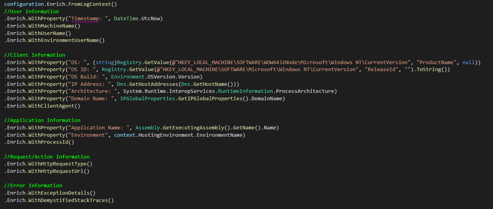

## Detailed Information
- Logs include the stack trace of a given error and are complemented by data colleted by the enrichers to provide a detailed list of information that can be used as a starting point into understanding an issue. 
- As mentioned in "Controlling Data" it was detected that some of the enrichers only populate when certain actions happen which is the case of the stack trace that only seems to appear when an unhandled error happens.

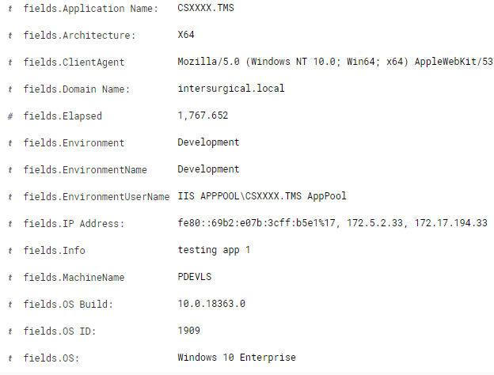
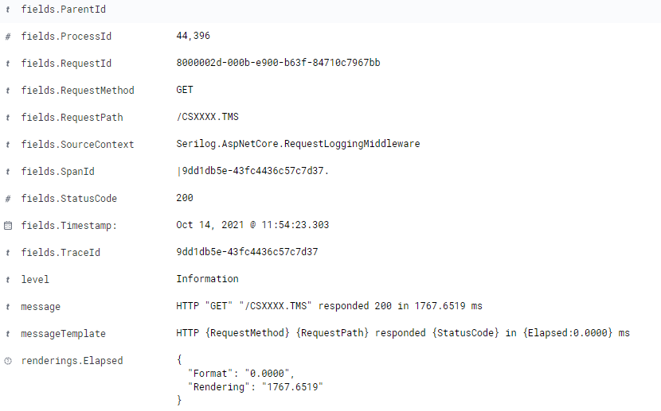


## Logs from multiple applications
- When the application itself is configured, its possible to define an index format that will identify the application in kibana's dashboard. This allows us to filter the list  and get the logs just for the application in question.

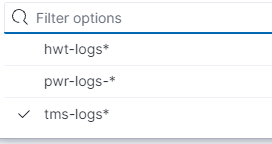

## Pushing data to multiple indexes
- In a short answer: yes, it's possible. 

- Althouth the solution cannot be considered clean code, it's possible to push data to multiple index from one application. For this to work, when coding the application itself you just have to duplicate the lines responsible by the exporting to the Elastic Stack. These are the only ones that change while the rest of the configuration remains the same.

In Program.cs

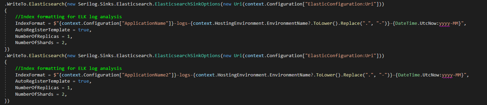

In appsettings.json

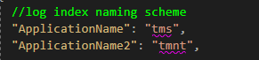

---

# Offline environment
- Serilog doesn't have any mechanism that allows the sending of pending logs when offilne. Although not ideal serilog supports local logging so the data it's not lost.

## Write to local file when connection is offline
* Serilog provides a way to write to a local file if the connection to the server fails when trying to send the logs.
* This is achieved through the EmitEventFailure property with the EmitEventFailureHandling.WriteToFailureSink option and configuring the FailureSink
  
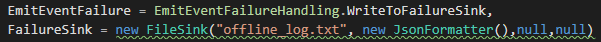

Source: [Serilog - Handling Errors](https://github.com/serilog-contrib/serilog-sinks-elasticsearch#handling-errors)

## Write to other server if the first fails to connect
* Serilog provides a way to configure multiple endpoints to write data and will try the next endpoint in case the first one fails to respond
  
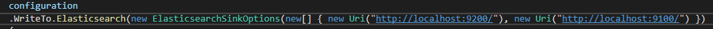

Source: [Configure the Sink](https://github.com/serilog-contrib/serilog-sinks-elasticsearch/wiki/Configure-the-sink)

## Full configuration

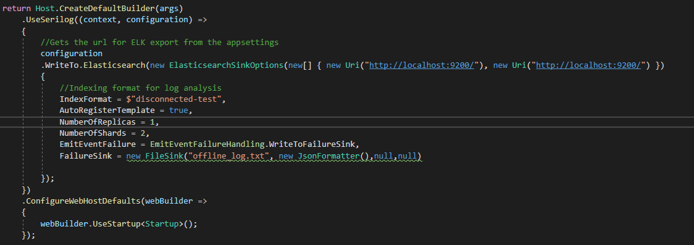

## Conclusion
* Even though the logs are not lost, when elasticsearch goes online again every log needs to be inserted and since serilog doesn't provide any mechanism for this effect, it would have to be developed.

---

## References
- [Logging into Elasticsearch using Serilog and viewing logs in Kibana | .NET Core Tutorial by Nick Chapsas](https://youtu.be/0acSdHJfk64)
- [SeriLog - Flexible, structured events — log file convenience](https://serilog.net/)
- [Serilog Best Practices by Ben Foster](https://benfoster.io/blog/serilog-best-practices/)
- [Serilog Do's and Don'ts by Eric St-Georges](https://esg.dev/posts/serilog-dos-and-donts/) 
- [List of official Serilog sinks](https://github.com/serilog/serilog/wiki/Provided-Sinks) 
- [How to enrich a log with Serilog enrichers](https://github.com/serilog/serilog/wiki/Enrichment)
- [Creating a User Name Middleware for enrichment of Asp .Net Core logs](https://github.com/serilog/serilog-aspnetcore/issues/157)